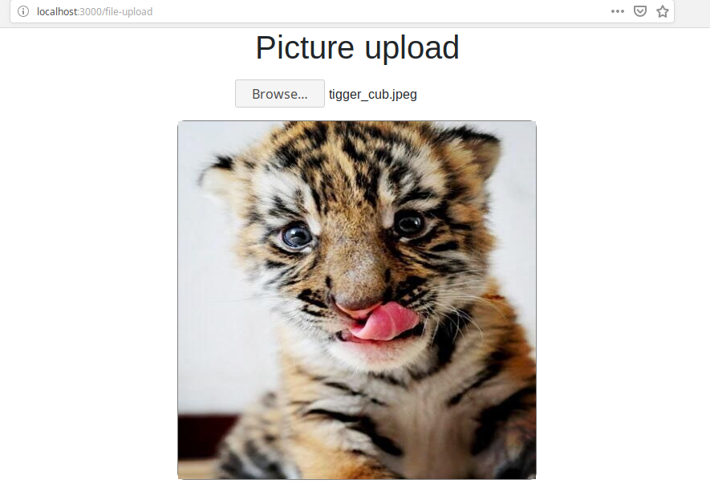

# Camera Web APP
> Web app implementing the Camera web API. 
> Note that the this API is not on a current W3C standards track, but it is supported on the Firefox OS platform. 

### Screenshots
### File upload


## Build Setup
``` bash
# install dependencies
$ npm install

# serve with hot reload at localhost:3000
$ npm run dev

# build for production and launch server
$ npm run build
$ npm start

# generate static project
$ npm run generate
```

For detailed explanation on how things work, checkout [Nuxt.js docs](https://nuxtjs.org).


